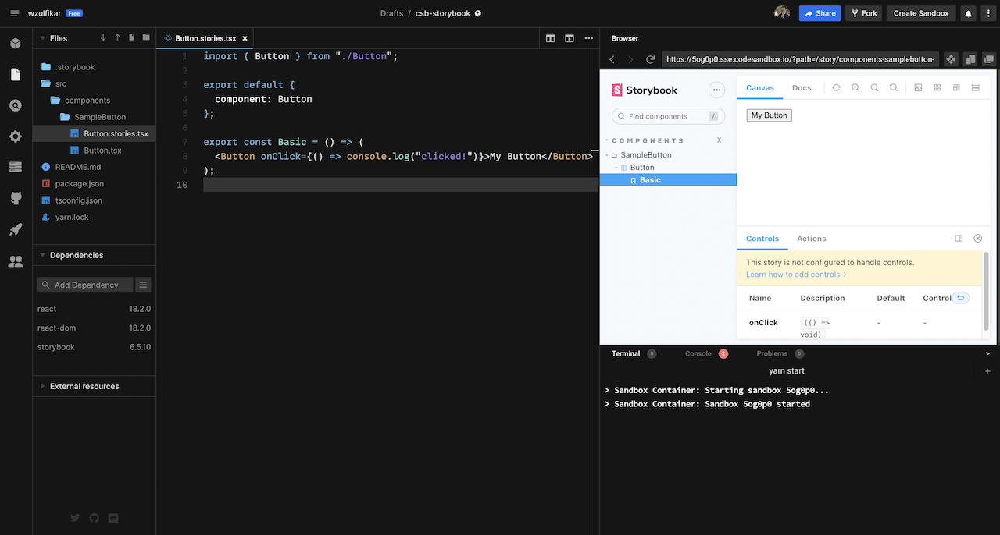

# Storybook in Codesandbox

Run Storybook in Codesandbox.

- Demo: https://5og0p0.sse.codesandbox.io
- Run your own Storybook: https://csb.app/s/github/wzulfikar/csb-storybook

To run locally:

- install dependencies: `yarn`
- run storybook: `yarn start`

### Included

- Typescript
- Absolute path

**Notes:**

- If you added/changed an addon and the expected outcome doesn't reflect, try restarting the server in Codesandbox's "Server Control Panel" (left sidebar)
